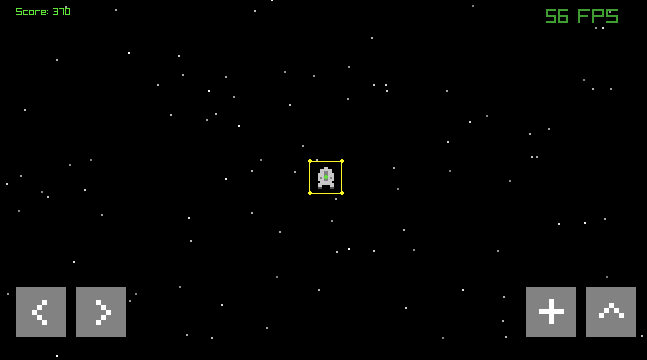

# Space Pixel Game

  

**Space Pixel Game** is an open-source, space-themed exploration and combat game featuring charming pixel art graphics and engaging arcade-style gameplay. Explore vast procedurally generated star systems, battle diverse enemies, gather resources, craft upgrades, and uncover the secrets of the galaxy!

# Name Options
The Dying Echoes of Iara
Iara's Starfall Nomads
Iara's Lament: Voidfarers

## Frameworks and Language

Space Pixel Game is a simple game developed using C++ and Raylib.

## Screenshots

## Features (TODO)

*   **Explore a vast, procedurally generated universe:** Discover countless star systems, planets, asteroid fields, and nebulae. No two playthroughs are the same!
*   **Engage in thrilling space combat:** Battle a variety of enemy ships with unique attack patterns and behaviors.
*   **Gather resources and craft upgrades:** Mine asteroids, salvage derelict ships, and explore planets to find valuable resources. Use them to craft new weapons, ship modules, and consumables.
*   **Customize your ship:** Upgrade your ship's weapons, shields, engines, and more to suit your playstyle.
*   **Retro pixel art aesthetic:** Immerse yourself in a charming and nostalgic pixel art world.

## Getting Started

### Local compilation & Running the Game 
[How to Run](docs/how_to_run.md)

## How to Play

*   **Movement:** You have three options for controlling your ship's movement:
    * Arrow Keys:
        * Up Arrow: Thrust forward (accelerate).
        * Down Arrow: Thrust backward (decelerate/reverse).
        * Left Arrow: Rotate counter-clockwise (turn left).
        * Right Arrow: Rotate clockwise (turn right).
    * WASD Keys: (Alternative Control Scheme)
        * W Key: Thrust forward (accelerate).
        * S Key: Thrust backward (decelerate/reverse).
        * A Key: Rotate counter-clockwise (turn left).
        * D Key: Rotate clockwise (turn right).
    * Mobile
        * ^ Icon: Thrust forward (accelerate).
        * < Icon: Rotate counter-clockwise (turn left).
        * \> Icon: Rotate clockwise (turn right).
*   **Shooting:** 
    * Keyboard:
        * Space Key: Shoot a beam forward
    * Mobile:
        * Screen control +: Shoot a beam forward
*   **Objective:** Your primary goal is to explore the procedurally generated galaxy, gather resources to upgrade your ship, and survive challenging encounters with enemy ships. You must reach the galactic core, where a powerful ancient artifact awaits, said to hold the key to stopping the Void Blight that threatens to consume the galaxy.

## Reporting Issues

If you encounter any bugs or have suggestions for improvements, please open an issue on the [GitHub issue tracker](https://github.com/maiconpintoabreu/space-pixel-game/issues).

When reporting an issue, please include:

*   A clear and descriptive title.
*   A detailed description of the issue, including steps to reproduce it if possible.
*   Screenshots or GIFs, if applicable.
*   Your operating system and browser version.

## Contact

*   Maicon Santana - maiconspas@gmail.com
*   BlueSky: [@maiconpinto.bsky.social](https://bsky.app/profile/maiconpinto.bsky.social)

---

We hope you enjoy playing Space Pixel Game!
